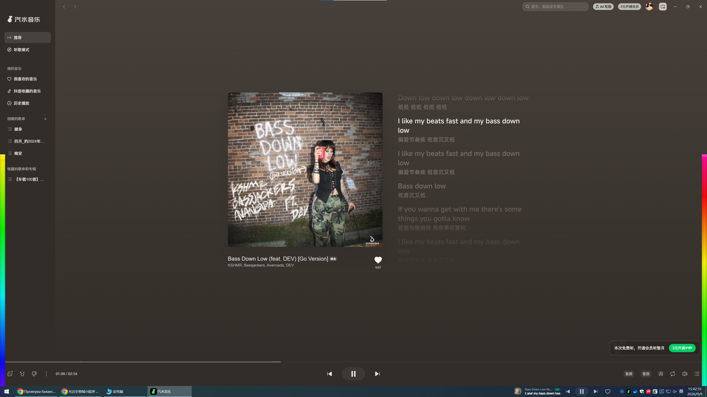

# Aurora Audio Bars

Windows 系统音频实时可视化：屏幕左右两侧各一条从底部向上生长的 **Aurora 霓虹能量条**（全色谱渐变、透明置顶、点击穿透）。




## 特性

- **Aurora 全色谱能量条**：从左/右屏幕边缘底部向上生长，360° 色相连续渐变（紫→蓝→青→绿→黄→橙→红→粉→紫），色彩以 12s/圈缓慢流动
- **实时响应**：60fps 渲染，上升 ≈30ms / 下降 ≈100ms，像真正的实时音频电平表
- **运动拖影**：主体上方保留有限 4 帧的短暂惯性尾迹，随主体回收，绝无永久残留
- **液态顶端**：顶部 bloom 发光圆头 + 光晕尾，随音量呼吸
- **声音驱动**：WASAPI Loopback 采集系统输出（NAudio 2.2.1，MIT）；2048 点 FFT + Hann 窗 + AGC 自动增益，单一全局音量映射高度
- **两侧对称、相位不同**：左以紫起色、右以青起色（同一色谱，视觉平衡）
- **左右声道分离（可选）**：托盘开启后，左条只显示左声道、右条只显示右声道；关闭时两侧显示合并后的整体音量（默认关闭）
- **宽度可调**：托盘/命令行 1–8mm 档位
- **透明置顶、点击穿透**（WS_EX_TRANSPARENT + LAYERED + TOOLWINDOW + NOACTIVATE）
- **多显示器** + Per-Monitor V2 DPI 感知
- **低资源占用**：实测 CPU ≈ 0%（音频播放时单核 <2%）

## 使用

```powershell
dotnet build src/MouseAudioVisualizer -c Release
# 或直接运行发布产物
src/MouseAudioVisualizer/bin/Release/net8.0-windows/MouseAudioVisualizer.exe
# 可选：自定义条宽
src/MouseAudioVisualizer/bin/Release/net8.0-windows/MouseAudioVisualizer.exe --bar-width-mm 3
```

运行后无主窗口，仅托盘图标 + 屏幕两侧能量条。播放任意音频即可看到律动。

## 托盘

- 启用/禁用
- 声道分离：左条=左声道 / 右条=右声道（可开关，默认关闭）
- 强度：低 0.6x / 中 1.0x / 高 1.6x
- 透明度：90% / 70% / 50% / 30%
- 条宽：1mm / 2mm / 3mm / 5mm / 8mm
- 开机自启（HKCU Run 注册表键）
- 退出

## 构建

- .NET 8 SDK（Windows）
- 依赖：NAudio 2.2.1（NuGet）

```powershell
dotnet build src/MouseAudioVisualizer/MouseAudioVisualizer.csproj -c Release
```

## 目录结构

```
src/
├── MouseAudioVisualizer/   # 主程序 (WPF)
│   ├── Program.cs          # 入口 + 应用宿主
│   ├── Audio/              # 音频捕获 / FFT / 平滑 / AGC
│   ├── Visual/             # 边缘能量条窗口 / 渲染 / Win32 封装
│   └── Shell/              # 托盘
└── SpectrumProbe/          # 开发工具：控制台频谱数值验证
    # 用法: SpectrumProbe.exe --auto [--play <wav>] [--secs N]
```

## 已知限制

- 全屏独占游戏：透明悬浮窗不显示在独占全屏之上（系统限制）。
- 个别虚拟声卡 / 蓝牙设备 loopback 行为异常，建议使用默认输出设备。
- 开机自启通过 HKCU Run 注册表键实现。
- 不同 DPI 显示器混用时左右条宽度略有偏差（按 96 DPI 换算，一般可接受）。

## 许可与合规

- 核心依赖 NAudio（MIT）。
- 本仓库代码为原创实现；调研中引用的无 LICENSE 项目（CursorTrail、chromascope）仅参考架构思路，未复制任何代码。

方案详见 [PLAN.md](PLAN.md)。